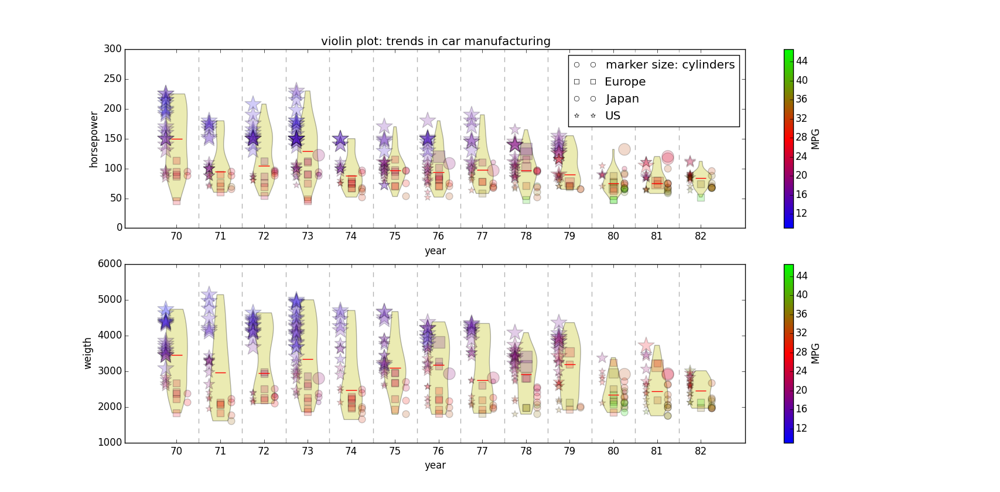
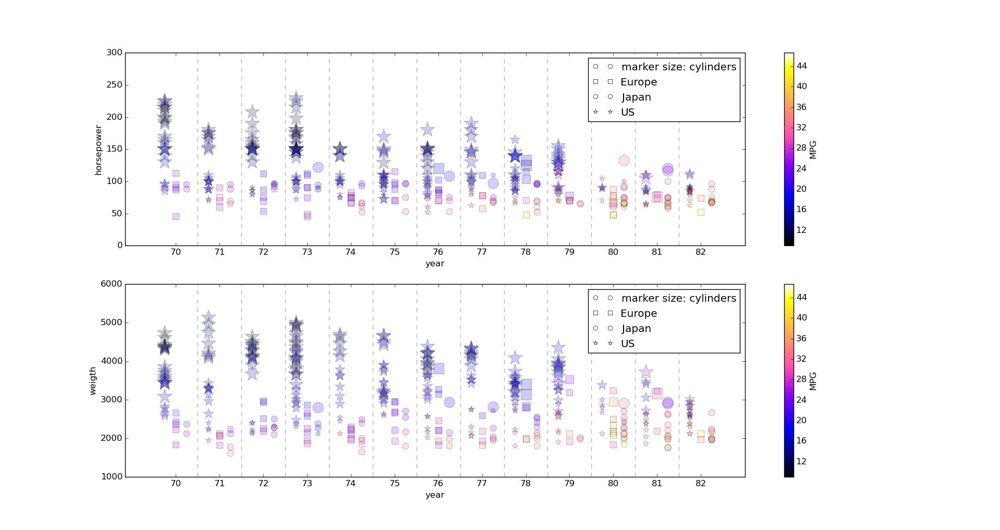
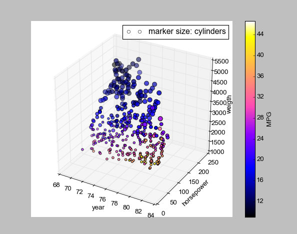

scientific-visualization
========================

Scientific Visualization Assignments

set up
------

 * `pip install matplotlib`
 * `pip install colorlog`

run
---

 * `python ./main.py 2d_split_violin`
 * `python ./main.py 2d_split`
 * `python ./main.py 3d`

screenshots
-----------

